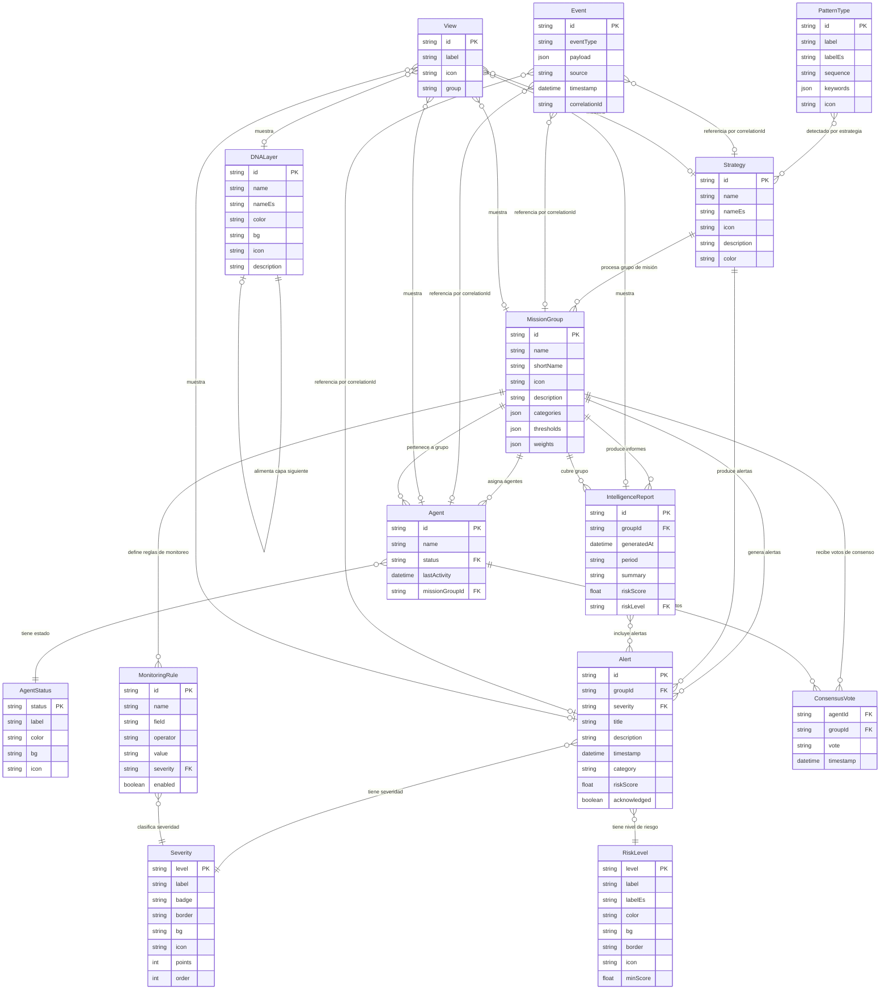
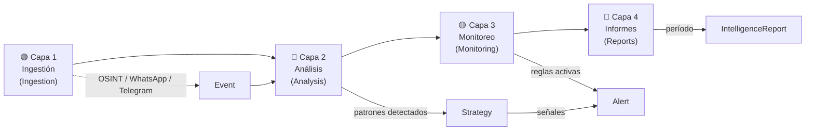
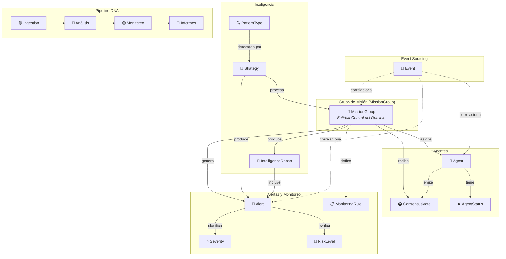
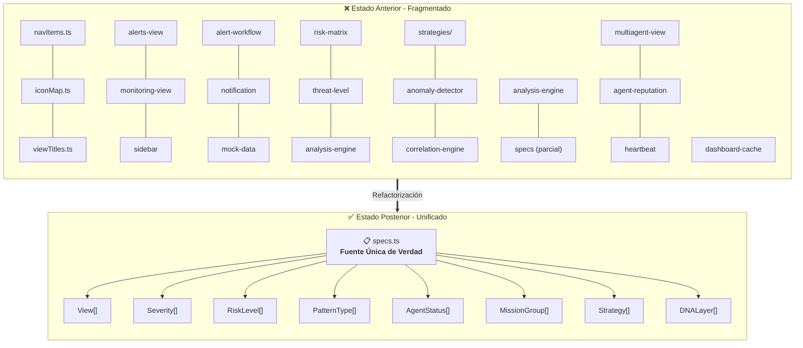
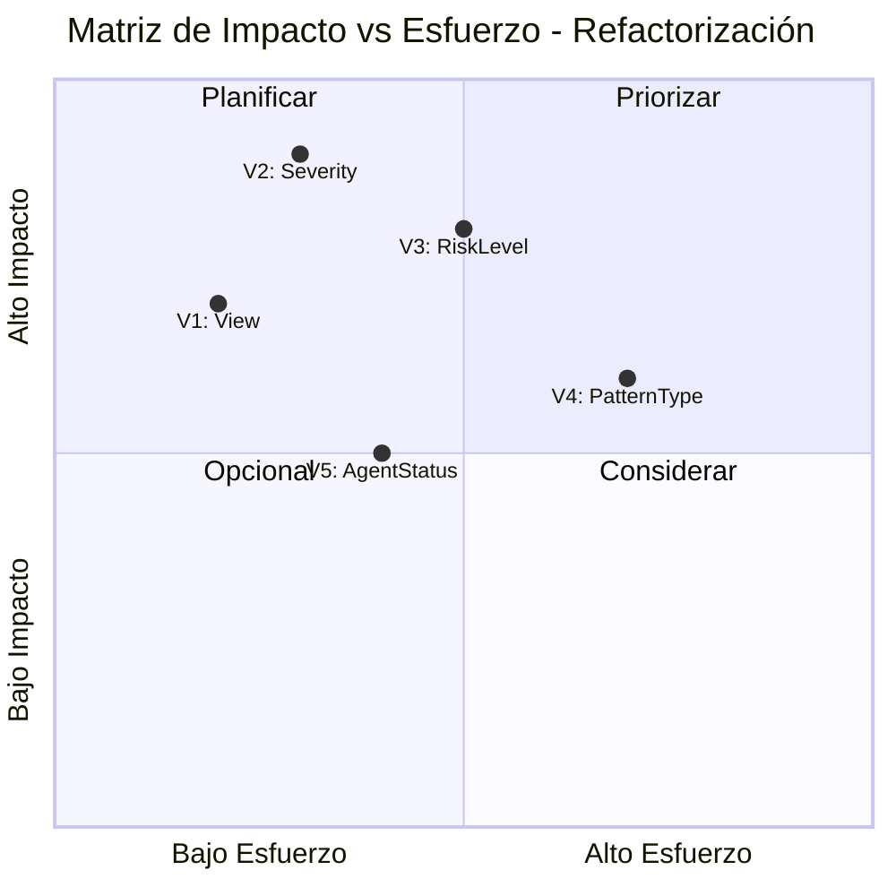
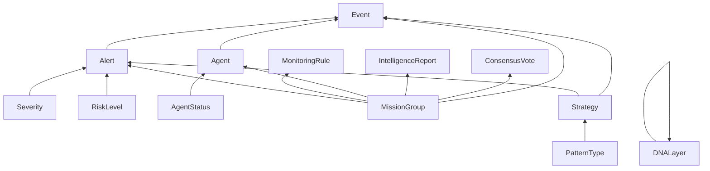

# Arquitectura de la Plataforma Whatomate Intelligence

> Diagrama Entidad-Relación y documentación de la arquitectura del sistema de inteligencia.

---

## Diagrama Entidad-Relación (ER)



---

## Diagrama de Flujo del Pipeline DNA



---

## Diagrama de Relaciones Centrado en MissionGroup



---

## Violaciones Identificadas y Transformaciones

### Resumen de Violaciones

| # | Violación | Ubicaciones Afectadas | Severidad | Impacto |
|---|-----------|----------------------|-----------|---------|
| V1 | **Entidad de Navegación fragmentada** | `navItems`, `iconMap`, `viewTitles` (3 registros) | 🔴 CRÍTICA | Inconsistencia en UI, datos duplicados sin fuente única de verdad |
| V2 | **Entidad Severity fragmentada** | 6 ubicaciones dispersas | 🔴 CRÍTICA | Severidades inconsistentes, badges/colores diferentes por vista |
| V3 | **Límites de nivel de riesgo inconsistentes** | 3 archivos con umbrales contradictorios | 🟠 ALTA | Cálculos de riesgo erróneos, alertas mal clasificadas |
| V4 | **Metadatos de patrón divididos** | 5 archivos con definiciones parciales de PatternType | 🟠 ALTA | Patrones no detectados, keywords duplicadas o faltantes |
| V5 | **Configuración de AgentStatus duplicada** | 4 lugares con definiciones de estado de agente | 🟡 MEDIA | Estados visuales diferentes, comportamiento impredecible |

### Detalle de Violaciones

#### V1: Fragmentación de Entidad de Navegación

```
ANTES (Fragmentado):
┌─────────────────┐  ┌─────────────────┐  ┌─────────────────┐
│    navItems      │  │    iconMap      │  │   viewTitles    │
│─────────────────│  │─────────────────│  │─────────────────│
│ id: "dashboard" │  │ dashboard: 🏠   │  │ dashboard:      │
│ id: "monitoring"│  │ monitoring: 📡  │  │  "Panel"        │
│ id: "strategies"│  │ strategies: 🧠  │  │ monitoring:     │
│      ...        │  │      ...        │  │  "Monitoreo"    │
└─────────────────┘  └─────────────────┘  └─────────────────┘
         ↕ sin relación explícita ↕

DESPUÉS (Unificado):
┌─────────────────────────────────────────┐
│              View                        │
│─────────────────────────────────────────│
│ id: "dashboard"                         │
│ label: "Panel"                          │
│ icon: "🏠"                              │
│ group: "intelligence"                   │
│─────────────────────────────────────────│
│ id: "monitoring"                        │
│ label: "Monitoreo"                      │
│ icon: "📡"                              │
│ group: "intelligence"                   │
└─────────────────────────────────────────┘
```

#### V2: Fragmentación de Entidad Severity

```
ANTES (6 ubicaciones):
📁 alerts-view.tsx     → const CRITICAL = { color: "red", ... }
📁 monitoring-view.tsx → const CRITICAL = { color: "#ff0000", ... }
📁 sidebar.tsx         → const SEVERITIES = { critical: { ... } }
📁 alert-workflow.ts   → const SEVERITY_MAP = { ... }
📁 notification.ts     → const SEVERITY_LABELS = { ... }
📁 mock-data.ts        → const severityConfig = { ... }

DESPUÉS (1 fuente de verdad):
📁 specs.ts → export const SEVERITY_LEVELS: Severity[] = [
   { level: "CRITICA", label: "Crítica", badge: "destructive", ... },
   { level: "ALTA",    label: "Alta",    badge: "warning",     ... },
   { level: "MEDIA",   label: "Media",   badge: "default",     ... },
   { level: "BAJA",    label: "Baja",    badge: "secondary",   ... },
   { level: "INFO",    label: "Info",    badge: "outline",     ... },
]
```

#### V3: Límites de Nivel de Riesgo Inconsistentes

```
ANTES (3 archivos, umbrales contradictorios):
📁 risk-matrix/route.ts  → critical: >= 80
📁 threat-level.ts       → critical: >= 75
📁 analysis-engine.ts    → critical: >= 85

DESPUÉS (1 definición canónica):
📁 specs.ts → export const RISK_LEVELS: RiskLevel[] = [
   { level: "low",      minScore: 0,  ... },
   { level: "moderate", minScore: 25, ... },
   { level: "high",     minScore: 50, ... },
   { level: "critical", minScore: 75, ... },
]
```

#### V4: Metadatos de Patrón Divididos

```
ANTES (5 archivos):
📁 strategies/index.ts  → tipos de patrón (parcial)
📁 analysis-engine.ts   → secuencias de detección
📁 anomaly-detector.ts  → keywords por patrón
📁 correlation-engine.ts → reglas de correlación
📁 specs.ts             → definiciones de iconos

DESPUÉS (1 entidad unificada):
📁 specs.ts → export const PATTERN_TYPES: PatternType[] = [
   { id: "temporal",  label: "Temporal",  sequence: "T→T", keywords: [...] },
   { id: "spatial",   label: "Spatial",   sequence: "S→S", keywords: [...] },
   { id: "behavioral",label: "Behavioral",sequence: "B→B", keywords: [...] },
   { id: "anomaly",   label: "Anomaly",   sequence: "A→A", keywords: [...] },
   { id: "composite", label: "Composite", sequence: "*",   keywords: [...] },
]
```

#### V5: Duplicación de AgentStatus

```
ANTES (4 lugares):
📁 multiagent-view.tsx → const statusColors = { active: "green", ... }
📁 agent-reputation.ts → const AGENT_STATES = { ... }
📁 heartbeat.ts        → const STATUS_CONFIG = { ... }
📁 dashboard-cache.ts  → const agentStatusMap = { ... }

DESPUÉS (1 definición canónica):
📁 specs.ts → export const AGENT_STATUSES: AgentStatus[] = [
   { status: "active",   label: "Activo",    color: "green",  ... },
   { status: "inactive", label: "Inactivo",  color: "gray",   ... },
   { status: "warning",  label: "Advertencia",color: "yellow", ... },
   { status: "error",    label: "Error",     color: "red",    ... },
]
```

---

## Transformaciones Aplicadas

### Principio de Fuente Única de Verdad (SSOT)



### Catálogo de Entidades Unificadas

| Entidad | Propiedades | Valores Canónicos | Archivo Fuente |
|---------|------------|-------------------|----------------|
| `View` | id, label, icon, group | 8 vistas de navegación | `specs.ts` |
| `Severity` | level, label, badge, border, bg, icon, points, order | CRÍTICA / ALTA / MEDIA / BAJA / INFO | `specs.ts` |
| `RiskLevel` | level, label, labelEs, color, bg, border, icon, minScore | low / moderate / high / critical | `specs.ts` |
| `DNALayer` | id, name, nameEs, color, bg, icon, description | Ingestión / Análisis / Monitoreo / Informes | `specs.ts` |
| `MissionGroup` | id, name, shortName, icon, description, categories, thresholds, weights | 4 grupos de misión | `specs.ts` |
| `PatternType` | id, label, labelEs, sequence, keywords, icon | 5 tipos de patrón | `specs.ts` |
| `Strategy` | id, name, nameEs, icon, description, color | 6 estrategias | `specs.ts` |
| `AgentStatus` | status, label, color, bg, icon | active / inactive / warning / error | `specs.ts` |

---

## Cardinalidad de Relaciones

| Relación | Origen | Destino | Cardinalidad | Descripción |
|----------|--------|---------|-------------|-------------|
| MissionGroup → Alert | MissionGroup | Alert | 1:N | Un grupo genera múltiples alertas |
| MissionGroup → MonitoringRule | MissionGroup | MonitoringRule | 1:N | Un grupo define múltiples reglas |
| MissionGroup → Agent | MissionGroup | Agent | 1:N | Un grupo asigna múltiples agentes |
| MissionGroup → IntelligenceReport | MissionGroup | IntelligenceReport | 1:N | Un grupo produce múltiples informes |
| MissionGroup → ConsensusVote | MissionGroup | ConsensusVote | 1:N | Un grupo recibe múltiples votos |
| Alert → Severity | Alert | Severity | N:1 | Cada alerta tiene una severidad |
| Alert → RiskLevel | Alert | RiskLevel | N:1 | Cada alerta tiene un nivel de riesgo |
| Strategy → MissionGroup | Strategy | MissionGroup | 1:N | Una estrategia procesa múltiples grupos |
| Strategy → Alert | Strategy | Alert | 1:N | Una estrategia produce múltiples alertas |
| PatternType → Strategy | PatternType | Strategy | N:M | Patrones detectados por múltiples estrategias |
| DNALayer → DNALayer | DNALayer | DNALayer | 1:1 | Cada capa alimenta la siguiente (pipeline secuencial) |
| Agent → MissionGroup | Agent | MissionGroup | N:1 | Cada agente pertenece a un grupo |
| Agent → ConsensusVote | Agent | ConsensusVote | 1:N | Un agente emite múltiples votos |
| Agent → AgentStatus | Agent | AgentStatus | N:1 | Cada agente tiene un estado |
| IntelligenceReport → Alert | IntelligenceReport | Alert | 1:N | Un informe incluye múltiples alertas |
| MonitoringRule → Severity | MonitoringRule | Severity | N:1 | Cada regla clasifica por severidad |
| Event → * (cualquiera) | Event | Entidad | N:0..1 | Evento correlaciona con cualquier entidad vía correlationId |
| View → * (cualquiera) | View | Entidad | N:M | Vista muestra múltiples entidades |

---

## Matriz de Impacto de la Refactorización



---

## Notas de Implementación

### Convenciones de Nomenclatura
- **PK**: Clave primaria
- **FK**: Clave foránea
- Las entidades de configuración (`View`, `Severity`, `RiskLevel`, etc.) son **read-only** en runtime
- Las entidades operacionales (`Alert`, `Event`, `ConsensusVote`) son **write-heavy**
- `Event` utiliza el patrón **Event Sourcing** con `correlationId` para trazabilidad

### Reglas de Integridad Referencial
1. Toda `Alert` debe tener un `groupId` válido en `MissionGroup`
2. Todo `Agent` debe pertenecer a un `MissionGroup` existente
3. Los umbrales de `RiskLevel` deben estar ordenados ascendentemente por `minScore`
4. Las capas `DNALayer` siguen un orden estricto: Ingestión → Análisis → Monitoreo → Informes
5. Los `ConsensusVote` deben referenciar un `Agent` y `MissionGroup` existentes

### Dependencias entre Entidades


---

*Documento generado como parte de la auditoría arquitectónica de la Plataforma Whatomate Intelligence.*
*Última actualización: 2026-03-04*
